# Diagrammes de Classes UML - Architecture DDD

Ce document présente l'architecture complète du CRM à travers des diagrammes de classes UML organisés par bounded context.

---

## 🏗️ Vue d'Ensemble

Le projet suit une **architecture Domain-Driven Design (DDD)** avec :
- **5 microservices** communiquant via gRPC et NATS
- **~110 classes** réparties en bounded contexts
- **~62 relations** entre les entités

---

## 1️⃣ Shared Kernel : Value Objects & Base Classes

Le Shared Kernel contient tous les éléments partagés entre les services : Value Objects, base classes et exceptions.

```mermaid
classDiagram
    direction TB

    class ValueObject~T~ {
        <<abstract>>
        #props : T
        #constructor(props T)
        +equals(vo ValueObject~T~) bool
    }
    class StringValueObject {
        <<abstract>>
        +getValue() string
        +toString() string
    }
    class UuidValueObject {
        <<abstract>>
        +getValue() string
        +toString() string
        +equals(other UuidValueObject) bool
    }
    class Phone {
        +create(value string)$ Phone
    }
    class Email {
        +create(value string)$ Email
    }
    class Montant {
        -value : number
        -currency : string
        +create(v number, cur string)$ Montant
        +zero(cur string)$ Montant
        +fromString(raw string)$ Montant
        +getValue() number
        +getCurrency() string
        +add(other Montant) Montant
        +subtract(other Montant) Montant
        +multiply(factor number) Montant
        +isPositive() bool
        +isNegative() bool
        +isZero() bool
    }
    class TauxCommission {
        -value : number
        +create(v number)$ TauxCommission
        +getValue() number
        +toMultiplier() number
    }
    class TauxTva {
        -value : number
        +create(v number)$ TauxTva
        +getValue() number
        +toMultiplier() number
    }
    class Address {
        -street : string
        -city : string
        -postalCode : string
        -country : string
        -complement : string
        +create(props AddressProps)$ Address
        +getStreet() string
        +getCity() string
        +getPostalCode() string
        +getCountry() string
        +toPrimitives() AddressProps
    }

    class UtilisateurId { +create(v)$ UtilisateurId }
    class OrganisationId { +create(v)$ OrganisationId }
    class ProduitId { +create(v)$ ProduitId }
    class ClientId { +create(v)$ ClientId }
    class FactureId { +create(v)$ FactureId }
    class ContratId { +create(v)$ ContratId }
    class CommercialId { +create(v)$ CommercialId }
    class CommissionId { +create(v)$ CommissionId }
    class ExpeditionId { +create(v)$ ExpeditionId }

    class DomainEvent {
        <<abstract>>
        +eventId : string
        +occurredOn : Date
        +eventVersion : number
        +aggregateId : string
        +eventName()* string
        +toPrimitives()* Record
    }
    class AggregateRoot~E~ {
        -version : number
        #incrementVersion() void
        +getVersion() number
        +markEventsAsCommitted() void
    }

    class DomainException {
        +code : string
        +metadata : Record
        +toJSON() object
    }
    class NotFoundException
    class AlreadyExistsException
    class InvalidDataException
    class BusinessRuleException
    class VersionConflictException
    class UnauthorizedException

    ValueObject <|-- StringValueObject
    ValueObject <|-- UuidValueObject
    ValueObject <|-- Montant
    ValueObject <|-- TauxCommission
    ValueObject <|-- TauxTva
    ValueObject <|-- Address
    StringValueObject <|-- Phone
    StringValueObject <|-- Email
    UuidValueObject <|-- UtilisateurId
    UuidValueObject <|-- OrganisationId
    UuidValueObject <|-- ProduitId
    UuidValueObject <|-- ClientId
    UuidValueObject <|-- FactureId
    UuidValueObject <|-- ContratId
    UuidValueObject <|-- CommercialId
    UuidValueObject <|-- CommissionId
    UuidValueObject <|-- ExpeditionId
    DomainException <|-- NotFoundException
    DomainException <|-- AlreadyExistsException
    DomainException <|-- InvalidDataException
    DomainException <|-- BusinessRuleException
    DomainException <|-- VersionConflictException
    DomainException <|-- UnauthorizedException
```

**Composants** :
- **9 UUID Value Objects** : Identifiants typés pour garantir la sécurité des types
- **2 String VOs** : `Phone`, `Email` avec validation
- **3 Numeric VOs** : `Montant` (avec opérations arithmétiques), `TauxCommission`, `TauxTva`
- **1 Complex VO** : `Address` (objet composé)
- **Base Classes** : `DomainEvent`, `AggregateRoot` pour Event Sourcing/CQRS
- **6 Exceptions** : Hiérarchie complète pour la gestion d'erreurs métier

---

## 2️⃣ Service-Core : Users, Organisations & Clients

Le service-core gère l'authentification, les organisations, les clients et les documents. C'est le service fondamental dont dépendent tous les autres.

> **Pour voir le diagramme complet** : [Voir 02-service-core.mmd](../diagrams/02-service-core.mmd)

**Bounded Contexts** :
- **Users** (7 entités) : `Utilisateur`, `Role`, `Permission`, `Compte`, etc.
- **Organisations** (5 entités) : `Organisation`, `Societe`, `PartenaireMarqueBlanche`, etc.
- **Clients** (8 entités) : `ClientPartenaire`, `StatutClient`, conditions de paiement, etc.
- **Documents** (2 entités) : `PieceJointe`, `BoiteMail`

---

## 3️⃣ Service-Finance : Factures, Payments & Calendar

Le service-finance est le plus complexe avec 47 entités réparties en 3 bounded contexts.

> **Pour voir le diagramme complet** : [Voir 03-service-finance.mmd](../diagrams/03-service-finance.mmd)

**Bounded Contexts** :

### 📄 Factures (9 entités)
- `FactureEntity` ↔ `LigneFactureEntity` (OneToMany)
- Gestion des avoirs (self-reference)
- Relances automatiques avec `RegleRelanceEntity`

### 💳 Payments (27 entités)
- **Cycle de paiement** : `ScheduleEntity` → `PaymentIntentEntity` → `PaymentEventEntity`
- **6 PSP intégrés** : Stripe, PayPal, GoCardless, Slimpay, MultiSafepay, Emerchantpay
- **Retry & Reminder** : Chaînes complètes de retry avec backoff exponentiel
- **Audit & Risk** : Logs d'audit, scoring de risque, routage intelligent

### 📅 Calendar (11 entités)
- Configuration hiérarchique de prélèvement (système → société → client → contrat)
- Gestion des jours fériés par zone
- Planification automatique avec cutoff

---

## 4️⃣ Service-Engagement & Service-Logistics

### 🔔 Engagement (15 entités)
- **Notifications** : Système temps-réel avec WebSocket
- **Tâches** : Gestion complète avec priorités, échéances, statuts
- **Activités** : Historique des interactions clients
- **Conciergerie** : `DemandeConciergerie`, `CasJuridique`, `OperationCashback`

### 📦 Logistics (9 entités)
- **Expéditions** : `ExpeditionEntity` ↔ `ColisEntity` ↔ `TrackingEventEntity`
- **Fulfillment** : Système de lots avec `FulfillmentBatchEntity` → `FulfillmentBatchLineEntity`
- **Maileva Integration** : Envoi postal automatisé

> **Pour voir le diagramme complet** : [Voir 04-engagement-logistics.mmd](../diagrams/04-engagement-logistics.mmd)

---

## 5️⃣ Relations Inter-Services (Vue Macro)

Ce diagramme montre comment les entités clés se relient entre les 4 microservices.

> **Pour voir le diagramme complet** : [Voir 05-inter-services.mmd](../diagrams/05-inter-services.mmd)

**Points clés** :
- Toutes les entités sont scopées par `organisationId`
- Les `SocieteEntity` appartiennent aux `OrganisationEntity`
- Les `FactureEntity` facturent des `ClientPartenaireEntity`
- Les `PaymentIntentEntity` sont déclenchés par des `ScheduleEntity`
- Les `FulfillmentBatchLineEntity` créent des `ExpeditionEntity`

---

## 📚 Fichiers Complets

Tous les diagrammes sources sont disponibles dans [`docs/diagrams/`](../diagrams/) :

| Fichier | Description |
|---------|-------------|
| `00-complete-class-diagram.mmd` | Diagramme complet (toutes sections combinées) |
| `01-shared-kernel.mmd` | Shared Kernel |
| `02-service-core.mmd` | Service-Core |
| `03-service-finance.mmd` | Service-Finance |
| `04-engagement-logistics.mmd` | Service-Engagement & Service-Logistics |
| `05-inter-services.mmd` | Relations inter-services |

**Rendu** : Ouvrez ces fichiers dans [mermaid.live](https://mermaid.live) ou utilisez l'extension VS Code Mermaid Preview.

---

## 🎯 Prochaines Étapes

- [ ] Générer les diagrammes de séquence pour les flux critiques
- [ ] Documenter les événements NATS entre services
- [ ] Créer les diagrammes de composants par service
- [ ] Ajouter les diagrammes d'état pour les workflows métier
