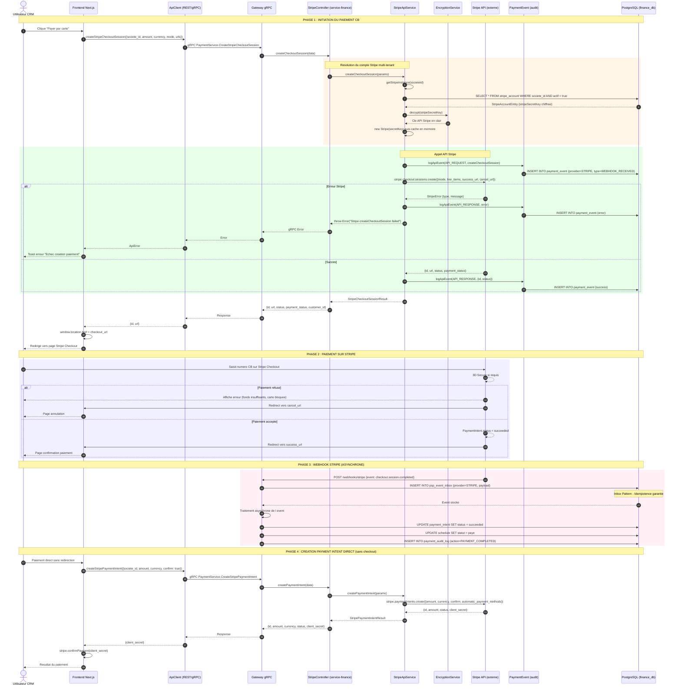
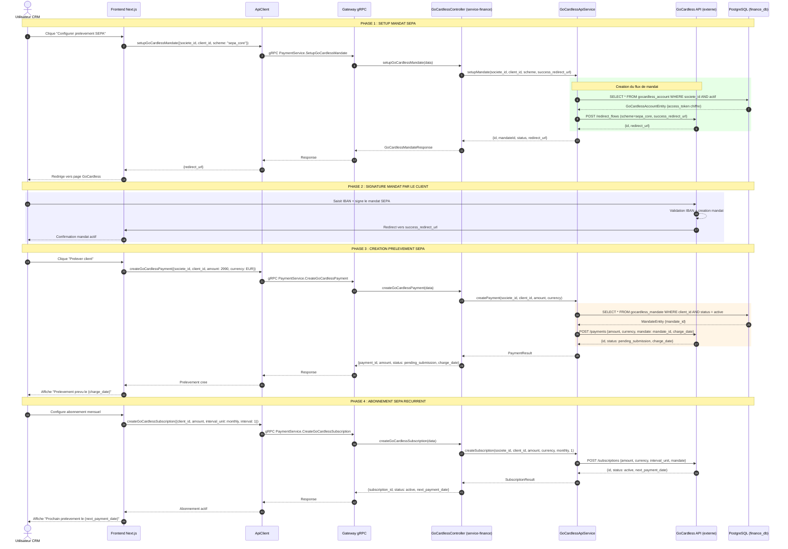
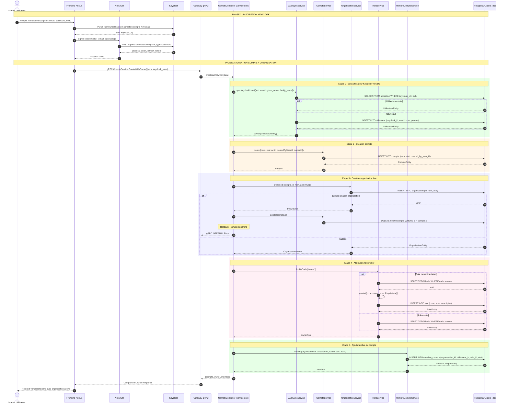

# Diagrammes de Sequence Dynamiques - CRM

> Generees depuis l'analyse de la codebase reelle.
> Rendu: coller dans [mermaid.live](https://mermaid.live), VS Code (extension Mermaid), ou tout fichier `.md` sur GitHub.

---

## 1. Authentification JWT (Keycloak + NextAuth + gRPC)

**Fichiers sources:**
- `frontend/src/lib/auth/auth.config.ts` - Configuration NextAuth + Keycloak
- `frontend/src/middleware.ts` - Protection des routes
- `frontend/src/lib/auth/auth.server.ts` - Profil utilisateur SSR
- `services/service-core/src/infrastructure/grpc/users/auth-sync.controller.ts` - Sync Keycloak
- `services/service-core/src/infrastructure/grpc/users/compte.controller.ts` - Gestion comptes

sequenceDiagram
    autonumber
    actor U as Utilisateur
    participant LP as Page Login (Next.js)
    participant MW as Middleware (middleware.ts)
    participant NA as NextAuth (auth.config.ts)
    participant KC as Keycloak (IdP OAuth2)
    participant GS as auth.server.ts (SSR)
    participant GRPC as service-core (gRPC)
    participant DB as PostgreSQL (core_db)

    Note over U, DB: PHASE 1 : LOGIN INITIAL

    U->>LP: Saisit email + mot de passe
    LP->>NA: signIn("credentials", {email, password})

    rect rgb(255, 245, 230)
        Note over NA, KC: Echange OAuth2 Resource Owner Password
        NA->>KC: POST /openid-connect/token grant_type=password, scope=openid email profile
        KC-->>KC: Verifie identifiants dans realm
        alt Identifiants invalides
            KC-->>NA: 401 Unauthorized
            NA-->>LP: error: "Email ou mot de passe incorrect"
            LP-->>U: Affiche erreur de connexion
        else Identifiants valides
            KC-->>NA: {access_token, refresh_token, expires_in}
        end
    end

    NA->>KC: GET /openid-connect/userinfo Authorization: Bearer {access_token}
    KC-->>NA: {sub, email, name, given_name, family_name}

    rect rgb(230, 255, 230)
        Note over NA: Callback JWT : Stocke tokens dans session
        NA-->>NA: jwt callback -> {accessToken, refreshToken, expiresAt}
        NA-->>NA: session callback -> session.accessToken = token
    end

    NA-->>LP: Session creee (JWT cookie httpOnly)
    LP-->>U: Redirect vers / (Dashboard)

    Note over U, DB: PHASE 2 : ACCES PAGE PROTEGEE

    U->>MW: GET /clients
    MW->>MW: auth(request) verifie session

    alt Pas de session ou RefreshTokenError
        MW-->>U: Redirect vers /login?callbackUrl=/clients
    else Session valide
        MW->>MW: isPublicRoute("/clients") = false, NextResponse.next()
    end

    Note over U, DB: PHASE 3 : CHARGEMENT PROFIL SERVEUR (SSR)

    rect rgb(230, 240, 255)
        GS->>GS: auth() puis parseJWT(accessToken) extrait keycloakId

        GS->>GRPC: AuthSyncService.FindByKeycloakId({keycloak_id})
        GRPC->>DB: SELECT * FROM utilisateur WHERE keycloak_id = ?

        alt Utilisateur inexistant (premier login)
            DB-->>GRPC: null
            GRPC-->>GS: NOT_FOUND (code 5)
            GS->>GRPC: UtilisateurService.Create({keycloakId, email, nom, prenom})
            GRPC->>DB: INSERT INTO utilisateur (...)
            DB-->>GRPC: UtilisateurEntity
            GRPC-->>GS: Utilisateur cree
        else Utilisateur existant
            DB-->>GRPC: UtilisateurEntity
            GRPC-->>GS: Utilisateur trouve
        end

        GS->>GRPC: MembreCompteService.ListByUtilisateur({utilisateurId})
        GRPC->>DB: SELECT * FROM membre_compte WHERE utilisateur_id = ?
        DB-->>GRPC: MembreCompte[]
        GRPC-->>GS: {membres: [...]}

        loop Pour chaque membre
            GS->>GRPC: CompteService.Get({id: organisationId})
            GRPC->>DB: SELECT * FROM compte WHERE id = ?
            DB-->>GRPC: CompteEntity
            GS->>GRPC: RoleService.Get({id: roleId})
            GRPC->>DB: SELECT * FROM role WHERE id = ?
            DB-->>GRPC: RoleEntity
        end

        GS-->>GS: Construit AuthMeResponse {utilisateur, organisations[], hasOrganisation}
    end

    Note over U, DB: PHASE 4 : REFRESH TOKEN AUTOMATIQUE

    rect rgb(255, 240, 245)
        NA->>NA: jwt callback appelle shouldRefreshToken(expiresAt)
        Note over NA: Declenche si expiresAt - now <= 60s
        NA->>KC: POST /openid-connect/token grant_type=refresh_token
        alt Refresh OK
            KC-->>NA: Nouveaux {access_token, refresh_token, expires_in}
            NA-->>NA: Met a jour token dans session
        else Refresh echoue
            KC-->>NA: Erreur (token expire)
            NA-->>NA: token.error = "RefreshAccessTokenError"
            Note over MW: Prochain acces redirige vers /login
        end
    end

---

## 2. Paiement CB Stripe (Checkout Session + PaymentIntent)

**Fichiers sources:**
- `services/service-finance/src/interfaces/grpc/controllers/payments/stripe.controller.ts`
- `services/service-finance/src/infrastructure/psp/stripe/stripe-api.service.ts`
- `services/service-finance/src/infrastructure/security/encryption.service.ts`
- `services/service-finance/src/domain/payments/entities/stripe-account.entity.ts`
- `services/service-finance/src/domain/payments/entities/payment-event.entity.ts`
- `frontend/src/lib/api/index.ts` - ApiClient REST/gRPC

---

## 3. Paiement SEPA GoCardless (Mandat + Prelevement)

**Fichiers sources:**
- `services/service-finance/src/interfaces/grpc/controllers/payments/gocardless.controller.ts`
- `services/service-finance/src/infrastructure/psp/gocardless/gocardless-api.service.ts`
- `services/service-finance/src/domain/payments/entities/gocardless-account.entity.ts`
- `services/service-finance/src/domain/payments/entities/gocardless-mandate.entity.ts`

---

## 4. Creation de Compte avec Owner (Onboarding)

**Fichiers sources:**
- `services/service-core/src/infrastructure/grpc/users/compte.controller.ts` - CreateWithOwner
- `services/service-core/src/infrastructure/persistence/typeorm/repositories/users/auth-sync.service.ts`
- `services/service-core/src/infrastructure/persistence/typeorm/repositories/organisations/organisation.service.ts`

---

## Resume des flux

| # | Diagramme | Participants | Phases |
|---|-----------|-------------|--------|
| 1 | **Auth JWT** | Utilisateur, Page Login, Middleware, NextAuth, Keycloak, auth.server, service-core gRPC, PostgreSQL | Login, Protection routes, Profil SSR, Refresh token |
| 2 | **Paiement CB Stripe** | Utilisateur, Frontend, ApiClient, Gateway gRPC, StripeController, StripeApiService, EncryptionService, Stripe API, PaymentEvent, PostgreSQL | Checkout Session, Paiement 3DS, Webhook async, PaymentIntent direct |
| 3 | **Paiement SEPA GoCardless** | Utilisateur, Frontend, ApiClient, Gateway gRPC, GoCardlessController, GoCardlessApiService, GoCardless API, PostgreSQL | Setup mandat, Signature IBAN, Prelevement, Abonnement recurrent |
| 4 | **Creation Compte** | Utilisateur, Frontend, NextAuth, Keycloak, CompteController, AuthSyncService, CompteService, OrganisationService, RoleService, MembreCompteService, PostgreSQL | Inscription Keycloak, Sync utilisateur, Creation compte+org, Attribution role owner |
