# Diagramme de Cas d'Utilisation - CRM Winvest Capital

> **Type** : Use Case Diagram (Dynamique)
> **Source** : Analyse des proto gRPC, services NestJS, et cahiers des charges
> **Date** : 2026-02-10

## Diagramme Mermaid

```mermaid
graph TB
    Admin[Admin SuperAdmin]
    ADV[ADV]
    DirCom[Direction Commerciale]
    Manager[Manager]
    Commercial[Commercial VRP]
    Partenaire[Partenaire Apporteur]
    Compta[Comptabilite]
    Systeme[Systeme Moteur auto]

    subgraph AUTH[Authentification]
        UC_LOGIN((Se connecter))
        UC_ROLES((Gerer roles))
        UC_SESSIONS((Gerer sessions))
        UC_INVIT((Inviter membre))
    end

    subgraph USERS[Utilisateurs]
        UC_USERS((CRUD Utilisateurs))
        UC_ORGA((Gerer Organisations))
        UC_MEMBRES((Gerer membres))
    end

    subgraph CLIENTS[Clients]
        UC_CLI_CRUD((Creer Modifier client))
        UC_CLI_SEARCH((Rechercher client))
    end

    subgraph CONTRATS[Contrats]
        UC_CONTRAT((Creer Modifier contrat))
        UC_LIGNES((Gerer lignes contrat))
        UC_STATUT_C((Changer statut))
        UC_IMPORT((Importer contrats))
        UC_ORCH((Activer Suspendre Resilier))
    end

    subgraph COMMERCIAL_G[Gestion Commerciale]
        UC_APPORTEUR((Gerer apporteurs))
        UC_BAREME((Configurer baremes))
        UC_PALIER((Configurer paliers))
        UC_DISTRIB((Distribution))
        UC_PROD((Gerer produits))
    end

    subgraph COMMISSION[Commissions]
        UC_CALC((Calculer commissions))
        UC_RECUR((Generer recurrences))
        UC_REPRISE((Declencher reprises))
        UC_CONTEST((Contester commission))
        UC_RESOLV((Resoudre contestation))
    end

    subgraph BORDEREAU[Bordereaux Validation ADV]
        UC_GENER((Generer bordereau))
        UC_PRESEL((Preselectionner lignes))
        UC_SELECT((Cocher Decocher lignes))
        UC_VALID((Valider bordereau))
        UC_EXPORT_B((Exporter PDF Excel))
    end

    subgraph FINANCE[Paiements Factures]
        UC_PAY((Paiements SEPA))
        UC_FACT((Factures))
        UC_RELANCE((Relancer impayes))
        UC_RETRY((Rejouer AM04))
    end

    subgraph REPORTING[Reporting KPI]
        UC_DASH((Dashboard KPI))
        UC_COMPAR((Comparatifs))
        UC_SNAPSHOT((Snapshot mensuel))
        UC_EXPORT_A((Export analytique))
    end

    subgraph SUPPORT[Services Support]
        UC_NOTIF((Notifications))
        UC_EMAIL((Emails))
        UC_DOC((Documents))
        UC_CALENDAR((Agenda))
        UC_ACTIVITE((Activites))
        UC_AUDIT((Audit))
        UC_LOGIST((Logistique))
    end

    Admin --> UC_LOGIN
    Admin --> UC_ROLES
    Admin --> UC_SESSIONS
    Admin --> UC_INVIT
    Admin --> UC_USERS
    Admin --> UC_ORGA
    Admin --> UC_MEMBRES
    Admin --> UC_BAREME
    Admin --> UC_PALIER
    Admin --> UC_DISTRIB
    Admin --> UC_PROD
    Admin --> UC_AUDIT

    ADV --> UC_LOGIN
    ADV --> UC_PRESEL
    ADV --> UC_SELECT
    ADV --> UC_VALID
    ADV --> UC_EXPORT_B
    ADV --> UC_RESOLV
    ADV --> UC_CONTRAT
    ADV --> UC_STATUT_C
    ADV --> UC_IMPORT

    DirCom --> UC_LOGIN
    DirCom --> UC_DASH
    DirCom --> UC_COMPAR
    DirCom --> UC_EXPORT_A
    DirCom --> UC_SNAPSHOT
    DirCom --> UC_BAREME
    DirCom --> UC_AUDIT
    DirCom --> UC_APPORTEUR

    Manager --> UC_LOGIN
    Manager --> UC_DASH
    Manager --> UC_APPORTEUR
    Manager --> UC_COMPAR

    Commercial --> UC_LOGIN
    Commercial --> UC_CLI_CRUD
    Commercial --> UC_CLI_SEARCH
    Commercial --> UC_CONTRAT
    Commercial --> UC_LIGNES
    Commercial --> UC_CONTEST
    Commercial --> UC_DASH
    Commercial --> UC_CALENDAR
    Commercial --> UC_ACTIVITE

    Partenaire --> UC_LOGIN
    Partenaire --> UC_DASH
    Partenaire --> UC_CONTEST
    Partenaire --> UC_EXPORT_B

    Compta --> UC_LOGIN
    Compta --> UC_EXPORT_B
    Compta --> UC_EXPORT_A
    Compta --> UC_FACT
    Compta --> UC_PAY
    Compta --> UC_AUDIT

    Systeme --> UC_CALC
    Systeme --> UC_RECUR
    Systeme --> UC_REPRISE
    Systeme --> UC_GENER
    Systeme --> UC_PRESEL
    Systeme --> UC_NOTIF
    Systeme --> UC_EMAIL
    Systeme --> UC_RELANCE
    Systeme --> UC_RETRY
    Systeme --> UC_ORCH
    Systeme --> UC_LOGIST
    Systeme --> UC_SNAPSHOT
```

## Matrice Acteurs / Cas d'utilisation

| Acteur | Role | Cas d'utilisation principaux |
|---|---|---|
| **Admin / SuperAdmin** | Pilotage systeme | Gerer roles/permissions, sessions, MFA/break-glass, utilisateurs, organisations, membres, baremes, paliers, produits/referentiel, audit |
| **ADV** | Validation operationnelle | Preselectionner/cocher-decocher lignes bordereau, valider bordereau final, exporter PDF/Excel, resoudre contestations, gerer contrats et statuts, importer contrats |
| **Direction Commerciale** | Pilotage strategie | Dashboard KPI, comparatifs, snapshots mensuels, export analytique, configurer baremes, audit, gerer apporteurs |
| **Manager** | Encadrement equipe | Dashboard KPI, gerer apporteurs de son equipe, comparatifs |
| **Commercial / VRP** | Operationnel terrain | Creer/modifier clients, rechercher clients, creer contrats et lignes, contester commissions, dashboard perso, agenda, journaliser activites |
| **Partenaire / Apporteur** | Lecture restreinte | Dashboard perso (ses bordereaux), contester commissions, exporter ses bordereaux PDF/Excel |
| **Comptabilite** | Finance / Controle | Exporter bordereaux, export analytique, gerer factures, paiements SEPA, audit |
| **Systeme (moteur auto)** | Automatisation | Calculer commissions, generer recurrences, declencher reprises, generer bordereaux, preselectionner lignes, notifications/emails, relances impayes, retry AM04, orchestration contrats, logistique, snapshots KPI |

## Mapping Acteurs vers Microservices

| Domaine fonctionnel | Microservice(s) | Protos sources |
|---|---|---|
| Authentification | `service-core` (users) | `security/auth.proto`, `organisations/users.proto` |
| Utilisateurs | `service-core` | `organisations/users.proto`, `organisations/organisations.proto` |
| Clients | `service-core` | `clients/clients.proto` |
| Contrats | `service-commercial` | `contrats/contrats.proto` |
| Gestion Commerciale | `service-commercial` | `commerciaux/commerciaux.proto`, `products/products.proto` |
| Commissions | `service-commission` | `commission/commission.proto` |
| Bordereaux / Validation ADV | `service-commission` | `commission/commission.proto` (ADV Validation section) |
| Paiements / Factures | `service-finance` | `payments/payment.proto`, `factures/factures.proto` |
| Reporting KPI | `service-commission` + `service-core` | `commission/commission.proto` (Dashboard KPI), `dashboard/dashboard.proto` |
| Services Support | `service-core`, `service-engagement`, `service-logistics` | `notifications/notifications.proto`, `email/email.proto`, `documents/documents.proto`, `calendar/calendar.proto`, `activites/activites.proto`, `logistics/logistics.proto` |
